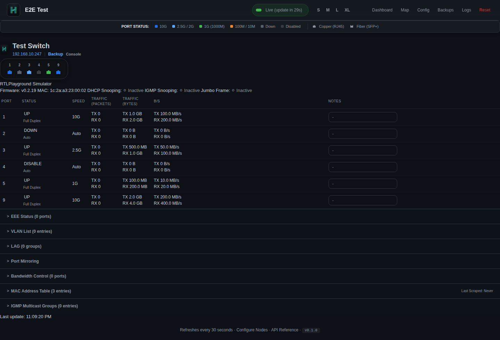

# RTLP Dashboard

**RTLPlayground** ファームウェア（RTL8372/RTL8373 ベースの 2.5GbE スイッチ）を搭載したスイッチのためのリアルタイム監視ダッシュボード



## 機能

- **リアルタイムポート状態**: リンク状態、速度、 duplex、TX/RX カウンター・パケット数
- **帯域チャート**: ライブ / 1時間 / 24時間 のロールング履歴（Chart.js + DuckDB、1年保持）
- **SFP+ DDMI**: 温度、電圧、バイアス電流、TX/RX パワーテレメトリー
- **MAC フォワーディングテーブル**: 検索・フィルタリング・自動ベンダー解決（IEEE OUI）
- **EEE / VLAN / LAG / MTU / ミラー / 帯域制御**: 状態表示
- **設定バックアップ & リストア**: Web UI から設定のダウンロード・アップロード
- **ファームウェア更新**: Web インターフェースからファームウェアをアップロード
- **リモート再起動 & コマンド実行**: 確認付き再起動、および CLI コマンド実行
- **ネットワークトポロジーマップ**: ポート単位の接続クライアント表示、ホスト名上書き対応、ドラッグ＆ドロップレイアウト
- **ログビューア**: ブラウザ上でサーバーログ表示、レベル制御、ダウンロード
- **設定エディタ**: Web ベースのスイッチ・ダッシュボード設定編集
- **ダークガラスモーフィック UI**: カスタムタイポグラフィ、すりガラス風コンポーネント
- **MAC ベンダー自動解決**: IEEE OUI データベースを自動ダウンロード、カスタム上書き対応

## 対応ハードウェア

詳細は [RTLPlayground supported devices](https://github.com/logicog/RTLPlayground/blob/main/doc/supported_devices.md) をご覧ください。

## クイックスタート

```bash
# フロントエンドをビルド
cd frontend && bun install && bun run build && cd ..

# バイナリをビルド
go build -o switch-dashboard ./cmd/switch-dashboard/

# 設定ファイルを用意（保存先: ~/.local/share/switch-dashboard/config.json）
mkdir -p ~/.local/share/switch-dashboard
cat > ~/.local/share/switch-dashboard/config.json << 'EOF'
{
  "title": "My Dashboard",
  "refresh_interval": 30,
  "switches": [
    {
      "name": "Core Switch",
      "ip": "192.168.10.247",
      "password": "1234",
      "model": "RTLPlayground",
      "port_count": 8,
      "enabled": true
    }
  ]
}
EOF

# 実行（データは ~/.local/share/switch-dashboard/ に保存）
./switch-dashboard
```

http://localhost:8081 を開く

### データディレクトリの変更

```bash
# カレントディレクトリに保存
./switch-dashboard -d .

# 明示的なパスを指定
./switch-dashboard -d /mnt/data -c /etc/switch-dashboard/config.json
```

## データディレクトリ構成

デフォルトのデータディレクトリ: `~/.local/share/switch-dashboard/`

```
~/.local/share/switch-dashboard/
├── config.json              # スイッチ設定（--config / -c で変更可）
├── history.duckdb           # DuckDB 時系列データベース
├── clients.json             # クライアントホスト名の上書き設定
└── layout_positions.json    # トポロジーマップのノード位置
```

## Docker

```bash
docker build -t switch-dashboard .
docker run -d --name switch-dashboard -p 8081:8081 \
  -v $(pwd)/config.json:/data/config.json \
  switch-dashboard
```

## API

| Method | Endpoint | Description |
|--------|----------|-------------|
| GET | `/api/switches` | 全スイッチのライブ状態（ポート、MAC、SFP、EEE、VLAN、LAG、ベンダー） |
| GET | `/api/switches/:ip/sfp` | SFP+ DDMI 診断情報 |
| GET | `/api/switches/:ip/transceiver` | SFP EEPROM 情報 |
| POST | `/api/switches/:ip/refresh_mac` | MAC フォワーディングテーブルを更新 |
| POST | `/api/switches/:ip/backup` | 設定バックアップをダウンロード |
| POST | `/api/switches/:ip/reboot` | スイッチを再起動 |
| POST | `/api/switches/:ip/upload` | ファームウェアをアップロード |
| POST | `/api/switches/:ip/cmd` | CLI コマンドを実行 |
| GET | `/api/speeds` | ポートごとのリアルタイム帯域（bps） |
| GET | `/api/history?ip=...&port=...&range=live\|1h\|24h` | 帯域履歴 |
| POST | `/api/notes` | ポート注釈を保存 |
| POST | `/api/reset` | 累積カウンターをリセット |
| GET | `/api/topology` | MAC フォワーディングテーブルからネットワークグラフを生成 |
| GET/POST | `/api/settings` | UI 設定 |
| GET/POST | `/api/config/settings` | ダッシュボード設定 |
| GET/POST | `/api/vendors` | MAC ベンダーカスタムマッピング |
| POST | `/api/vendors/update_oui` | IEEE OUI データベースをダウンロード |
| POST | `/api/clients/update_host` | トポロジー上のクライアントホスト名を上書き |
| GET/POST | `/api/layout_positions` | トポロジーノードのレイアウト位置 |
| GET | `/api/logs` | サーバーログ行を取得 |
| POST | `/api/logs/level` | ログレベルを変更 |
| POST | `/api/logs/clear` | サーバーログをクリア |
| GET | `/api/logs/download` | サーバーログをダウンロード |
| GET | `/api/backups` | 設定バックアップ一覧 |
| GET | `/api/backups/:filename/download` | バックアップファイルをダウンロード |
| DELETE | `/api/backups/:filename` | バックアップファイルを削除 |
| GET | `/api/openapi.json` | OpenAPI 3.0 仕様 |

## アーキテクチャ

```
User Browser (TypeScript + Chart.js)
        ↕  HTTP JSON API
Go Server (chi router, single binary, DuckDB history)
        ↕  HTTP JSON API
RTLPlayground Switch (uIP embedded webserver)
```

- **バックエンド**: Go 1.26+、chi router、DuckDB による帯域履歴保存（1年保持）
- **フロントエンド**: TypeScript、Chart.js（CDN）、bun ビルド、インライン CSS ダークテーマ
- **スクレイパー**: RTLPlayground の JSON エンドポイントに直接 HTTP 呼び出し（HTML 解析なし）
- **履歴**: DuckDB 時系列ストア、ライブ / 1h / 24h の集約に対応
- **MAC ベンダー解決**: IEEE OUI CSV を自動ダウンロード、カスタム上書き対応

## プロジェクト構成

```
├── cmd/switch-dashboard/   
├── e2e/                    
│   ├── tests/              
│   ├── playwright.config.ts
│   └── package.json        
├── frontend/
│   ├── src/                
│   └── package.json        
├── internal/
│   ├── server/             
│   ├── rtlplayground/      
│   ├── poller/             
│   ├── config/             
│   ├── history/            
│   ├── oui/                
│   └── store/              
├── templates/              
├── static/
│   ├── style.css           
│   ├── dist/               
│   └── logo.png
├── images/                 
├── Dockerfile              
├── Dockerfile.e2e          
└── LICENSE
```

## テスト

```bash
# Go ユニットテスト
go test ./...

# E2E テスト（サーバー起動済みであること）
cd e2e && npm install && npx playwright test

# E2E テスト（Docker 単体）
docker build -f Dockerfile.e2e -t switch-dashboard-e2e . && docker run --rm switch-dashboard-e2e

# スクリーンショット更新
cd e2e && OUT_DIR=../images npx playwright test tests/screenshots.spec.ts
```
